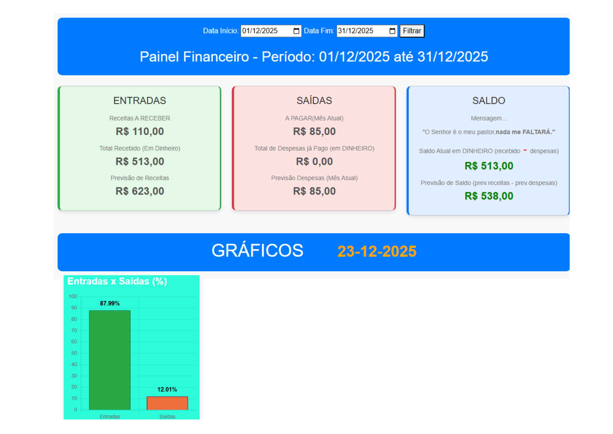
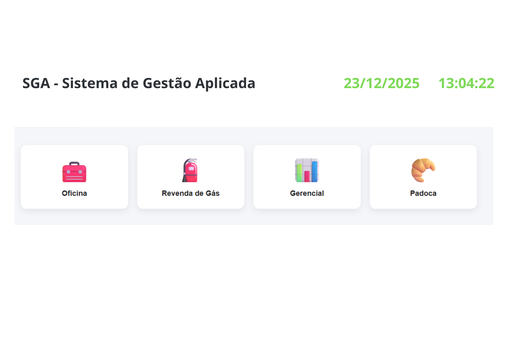
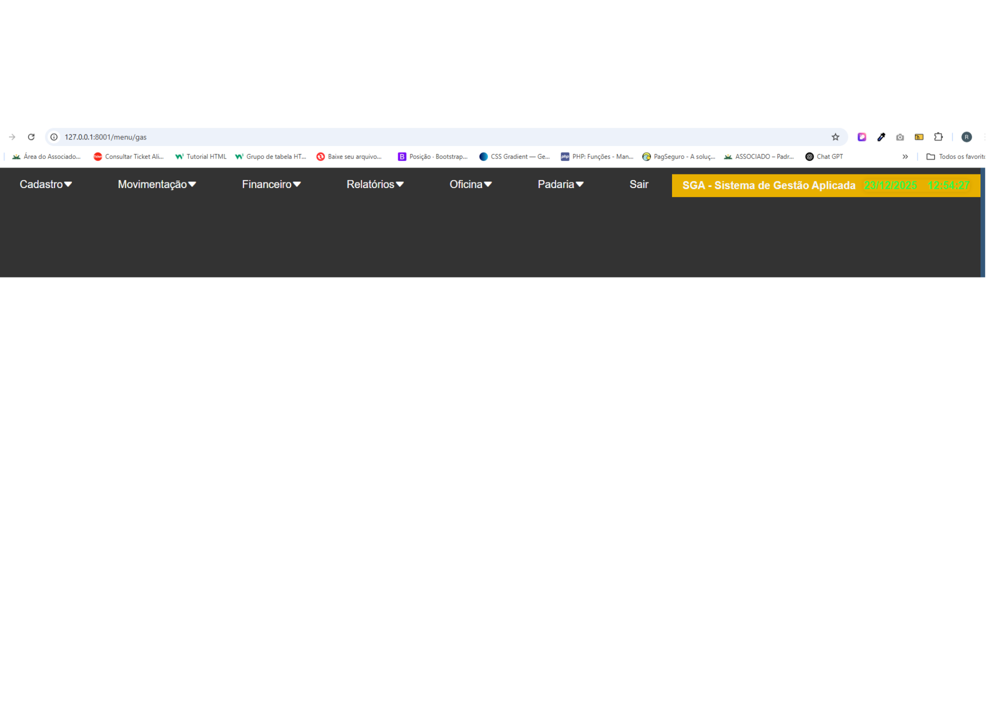

🚀 SGA - Sistema de Gestão Aplicada
O SGA é um ecossistema ERP completo desenvolvido para a gestão eficiente de revendas de gás e água, focado em Logística de Precisão e Inteligência de Dados.

🛠️ Diferenciais Técnicos
. Framework: Laravel (PHP) com arquitetura escalável.

. Banco de Dados: Modelagem relacional avançada em MySQL com foco em integridade e rastreabilidade.

. Infraestrutura Moderna: Configurado com Docker para padronização de ambiente e SSL para conexões seguras.

. IA e Big Data: Estrutura preparada para análise de dados e previsões de demanda, refletindo a especialização técnica em Inteligência Artificial.

📋 Módulos Principais
1. Gestão Financeira: Controle de fluxo de caixa, faturamento e relatórios gerenciais com gráficos.

2. Controle de Estoque: Gestão de movimentação de produtos e vasilhames em tempo real.

3. Logística e Expedição: Sistema de pedidos de coleta e rastreio integrado.

4. Automação: Notificações via WhatsApp e integração com APIs externas.

## 📸 Demonstração do Sistema

### Dashboard Financeiro e BI

### Gestão de Módulos (Revenda, Oficina e Padaria)

### Interface de Operação e Menus

